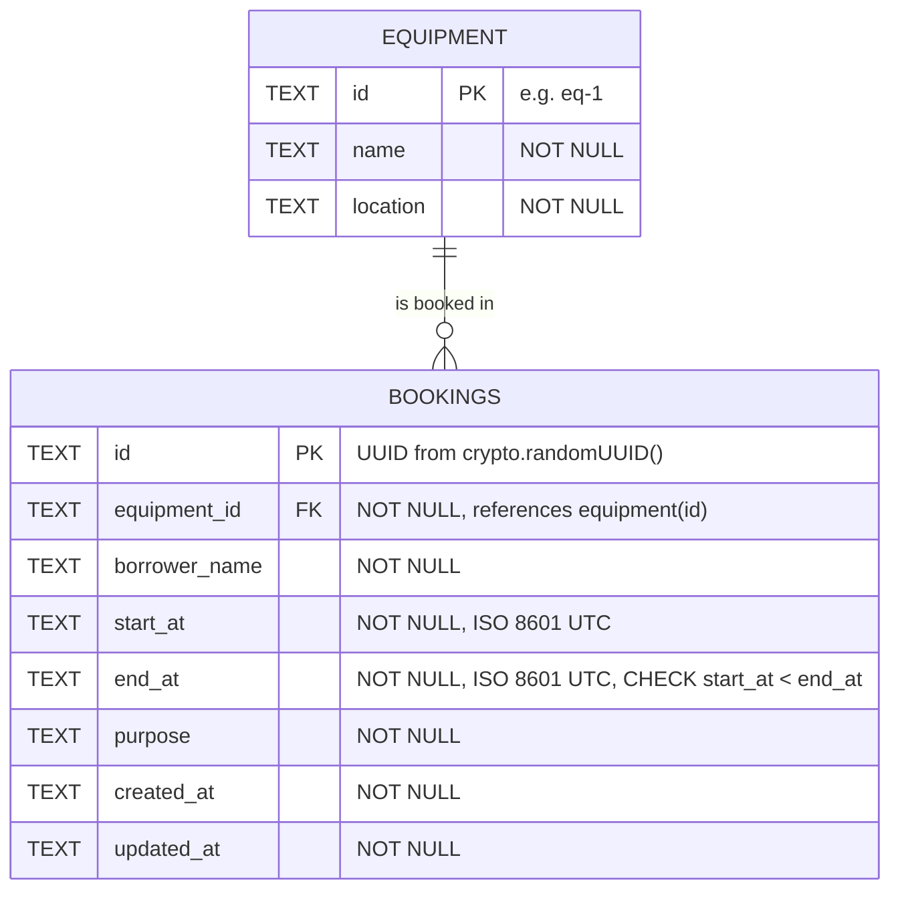

# Schema / ERD

Defined in [migrations/0001_init.sql](migrations/0001_init.sql). Database: Cloudflare D1 (SQLite).



Plain-text version:

```
equipment (1) ────────< (many) bookings
  id        PK              id             PK
  name                      equipment_id   FK → equipment.id
  location                  borrower_name
                            start_at, end_at   CHECK (start_at < end_at)
                            purpose
                            created_at, updated_at
```

## Design choices

| Choice | Reason |
|---|---|
| One-to-many: one piece of equipment, many bookings | Each booking is for exactly one item. `equipment_id` is a foreign key, so a booking can't point at equipment that doesn't exist. |
| Times stored as `TEXT` in the exact format `YYYY-MM-DDTHH:mm:ss.sssZ` (UTC) | SQLite has no date-time type. Every value is written with `toISOString()`, so all have the same width and timezone, and comparing them as text gives the same order as comparing the instants. That makes `start_at < ?` correct in SQL. |
| `CHECK (start_at < end_at)` in the table | A second safety net. The API already rejects bad ranges with a 400, but the database refuses them as well. |
| Index on `(equipment_id, start_at, end_at)` | The overlap check always looks for one equipment's bookings in a time range. The index lets SQLite skip other equipment's rows. |
| UUID booking ids | Can't be guessed or counted, unlike 1, 2, 3, and are generated without a round trip to the database. |
| The overlap rule is **not** a database constraint | SQLite has no exclusion constraint (PostgreSQL does). The API enforces it inside the same SQL statement as the write instead (`INSERT … WHERE NOT EXISTS`). See `API_CONTRACT.md`, business rule 3. |
