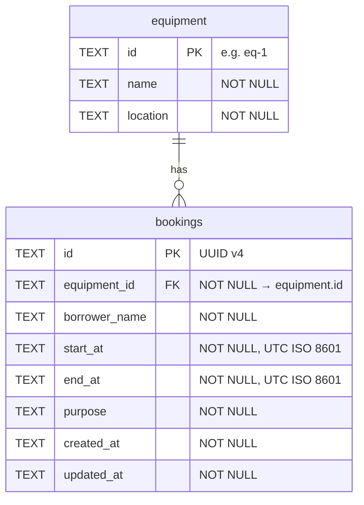

# Database Schema

| | |
|---|---|
| **DBMS** | Cloudflare D1 (SQLite) |
| **Source of truth** | [migrations/0001_init.sql](migrations/0001_init.sql) |
| **Tables** | `equipment`, `bookings` |
| **Naming** | Tables and columns use `snake_case` in the database and `camelCase` in the API (see [Column ↔ API field mapping](#6-column--api-field-mapping)) |
| **Time format** | ISO 8601 in UTC, written by `Date#toISOString()`: `YYYY-MM-DDTHH:mm:ss.sssZ` |

---

## 1. Entity Relationship Diagram

Crow's-foot notation: one `equipment` row has **zero or more** `bookings`. Each booking belongs to **exactly one** piece of equipment.



<details>
<summary>Plain-text version (for viewers without Mermaid)</summary>

```
┌──────────────────┐            ┌──────────────────────────┐
│ equipment        │            │ bookings                 │
├──────────────────┤            ├──────────────────────────┤
│ PK id            │──┤├────○<──│ PK id                    │
│    name          │  1    0..* │ FK equipment_id          │
│    location      │            │    borrower_name         │
└──────────────────┘            │    start_at              │
                                │    end_at                │
                                │    purpose               │
                                │    created_at            │
                                │    updated_at            │
                                └──────────────────────────┘
```

</details>

---

## 2. Relationships

| Parent | Child | Cardinality | Foreign key | On delete | On update |
|---|---|---|---|---|---|
| `equipment` | `bookings` | 1 : 0..* | `bookings.equipment_id` → `equipment.id` | `NO ACTION`. Equipment that still has bookings can't be deleted. | `NO ACTION` |

D1 enforces foreign keys by default. This was verified: inserting a booking with `equipment_id = 'eq-999'`, and deleting equipment that still has bookings, both fail with `FOREIGN KEY constraint failed`.

---

## 3. Data Dictionary

**Key:** PK = primary key · FK = foreign key · Null = whether `NULL` is allowed.
SQLite has no length types, so the maximum lengths in the **Rules** column are enforced by the API ([src/validation.ts](src/validation.ts)).

### 3.1 `equipment`

Shared items that can be booked. Read-only through the API and filled by seed data.

| Column | Type | Null | Key | Default | Rules | Description |
|---|---|:---:|:---:|---|---|---|
| `id` | TEXT | No | PK | — | Unique | Human-readable code, e.g. `eq-1` |
| `name` | TEXT | No | | — | | Display name, e.g. `Projector A` |
| `location` | TEXT | No | | — | | Where the item is kept, e.g. `Building 1` |

### 3.2 `bookings`

A reservation of one piece of equipment for a time range `[start_at, end_at)`.

| Column | Type | Null | Key | Default | Rules | Description |
|---|---|:---:|:---:|---|---|---|
| `id` | TEXT | No | PK | — | UUID v4 from `crypto.randomUUID()` | Booking identifier |
| `equipment_id` | TEXT | No | FK | — | Must exist in `equipment.id`; max 50 | The item being booked |
| `borrower_name` | TEXT | No | | — | Trimmed, 1–100 chars | Person making the booking |
| `start_at` | TEXT | No | | — | UTC ISO 8601; `< end_at` | Start of the booking (inclusive) |
| `end_at` | TEXT | No | | — | UTC ISO 8601; `> start_at` | End of the booking (exclusive) |
| `purpose` | TEXT | No | | — | Trimmed, 1–500 chars | Reason for the booking |
| `created_at` | TEXT | No | | — | UTC ISO 8601, set by the API | When the booking was created |
| `updated_at` | TEXT | No | | — | UTC ISO 8601, set by the API | When the booking was last changed |

---

## 4. Constraints

| Table | Constraint | Type | Rule | Enforced by |
|---|---|---|---|---|
| `equipment` | `id` | PRIMARY KEY | Unique, not null | Database |
| `bookings` | `id` | PRIMARY KEY | Unique, not null | Database |
| `bookings` | `equipment_id` | FOREIGN KEY | References `equipment(id)` | Database (also checked by the API → `400`) |
| `bookings` | `start_at < end_at` | CHECK | Start must be before end | Database (also checked by the API → `400`) |
| `bookings` | all columns | NOT NULL | No missing values | Database (also checked by the API → `400`) |
| `bookings` | **no overlap** per equipment | Business rule | No two bookings for the same `equipment_id` where `a.start_at < b.end_at AND b.start_at < a.end_at` | API, inside the same `INSERT` / `UPDATE` statement (`WHERE NOT EXISTS …`) → `409` |

SQLite has no exclusion constraint (PostgreSQL's `EXCLUDE USING gist` would do this), so the overlap rule can't be declared in the schema. The API checks it atomically in the write statement instead. See [API_CONTRACT.md](API_CONTRACT.md), business rule 3.

---

## 5. Indexes

| Name | Table | Columns | Unique | Purpose |
|---|---|---|:---:|---|
| *(automatic)* | `equipment` | `id` | Yes | Primary key lookup |
| *(automatic)* | `bookings` | `id` | Yes | `GET`, `PATCH` and `DELETE /bookings/:id` |
| `idx_bookings_equipment_time` | `bookings` | `equipment_id, start_at, end_at` | No | Overlap check: find one equipment's bookings in a time range without scanning other equipment's rows |

---

## 6. Column ↔ API field mapping

| Table | Column | API field |
|---|---|---|
| `equipment` | `id` / `name` / `location` | `id` / `name` / `location` |
| `bookings` | `id` | `id` |
| `bookings` | `equipment_id` | `equipmentId` |
| `bookings` | `borrower_name` | `borrowerName` |
| `bookings` | `start_at` | `startAt` |
| `bookings` | `end_at` | `endAt` |
| `bookings` | `purpose` | `purpose` |
| `bookings` | `created_at` | `createdAt` (response only) |
| `bookings` | `updated_at` | `updatedAt` (response only) |

---

## 7. Seed Data

Inserted by the migration:

| `id` | `name` | `location` |
|---|---|---|
| `eq-1` | Projector A | Building 1 |
| `eq-2` | Camera Canon EOS R6 | Building 2 |
| `eq-3` | Meeting Room M-301 | Building 3 |

---

## 8. Design Decisions

| Decision | Reason |
|---|---|
| **One-to-many** between equipment and bookings | Each booking is for exactly one item. The foreign key stops a booking from pointing at equipment that doesn't exist. |
| **Times stored as `TEXT` in one fixed UTC format** | SQLite has no date-time type. Every value is written with `toISOString()`, so all have the same width and timezone, and text order equals time order. That makes `start_at < ?` correct in SQL. Mixed formats such as `+07:00` and `Z` would compare wrongly (see [QUALITY_GATE_REVIEW.md](QUALITY_GATE_REVIEW.md), finding 1). |
| **Half-open interval `[start_at, end_at)`** | A booking ending at 11:00 and another starting at 11:00 don't overlap, so back-to-back bookings are allowed. |
| **`CHECK (start_at < end_at)` in the table** | A second safety net. The API already rejects bad ranges with `400`, but the database refuses them too if the API is bypassed. |
| **Composite index on `(equipment_id, start_at, end_at)`** | Matches the overlap query's filter, so the check stays fast as bookings grow. |
| **UUID booking ids** | Can't be guessed or counted, unlike 1, 2, 3, and are generated without a round trip to the database. |
| **`created_at` / `updated_at` audit columns** | Show when a booking was made or last changed. Not required by the brief, but useful when two people dispute a slot. |
